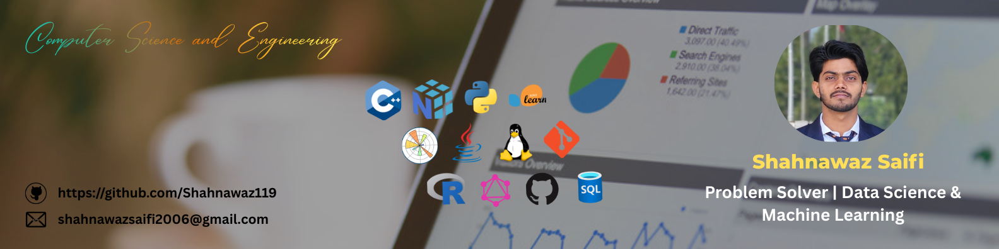

<h1 align="center">Hi 👋, I'm Shahnawaz Saifi</h1>

  

  

  

---

### 👨‍💻 About Me
- 🎓 Final year student passionate about **Data Science & Machine Learning**
- 🌱 Currently learning **Python, Machine Learning, Statistics**
- 🧠 Interested in **System Design & Problem Solving**
- 💬 Ask me about **Python, Pandas, NumPy, scikit-learn**
- 📫 Reach me at: **(add your email here)**

---

### 🧰 Languages & Tools

  
  
  
  
  
  

---

<h3>📊 GitHub Stats</h3>

  

<h3>🔥 GitHub Streak</h3>

  

---

### 🔥 GitHub Streak

  

---

⭐ *Thanks for visiting my profile! Feel free to explore my repositories.*
